<h1>Como configurar cron jobs no windows com Agendador de tarefas</h1>

<h2>Passo a passo</h2>

Esse passo a passo mostrar como configurar o cron job, no final desse arquivo voce encontra mais informações de quais cron jobs voce devera criar

 

1 - Busque por agendador de tarefas no seu sistema

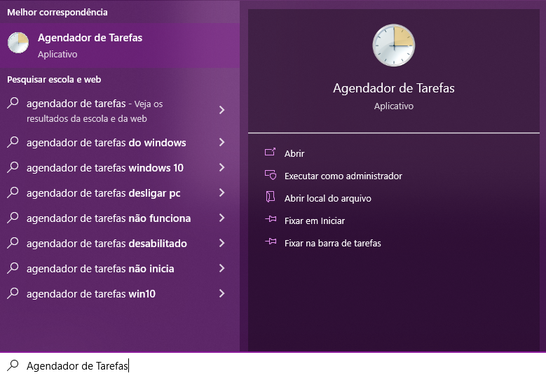
   

2- Ao abrir essa janel, clique em Biblioteca do Agendados

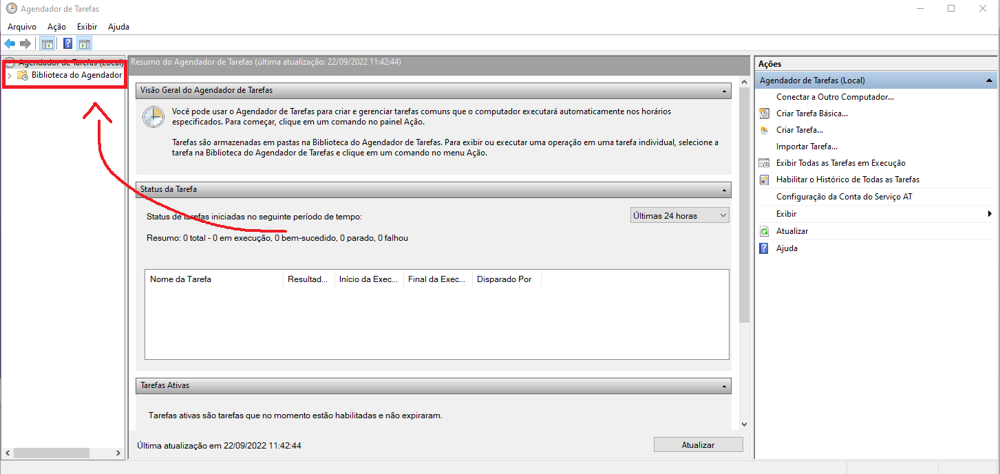
   

3 - Clique em Criar tarefa

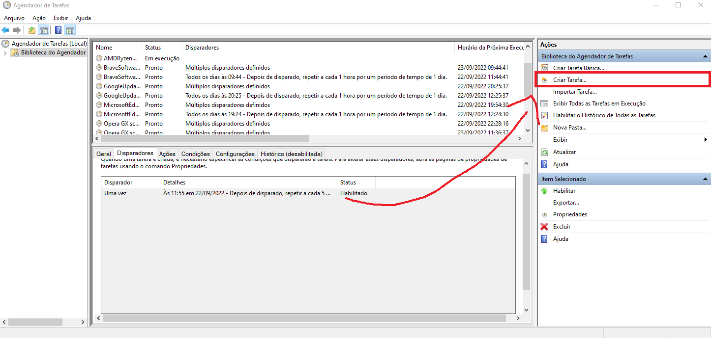
   

4 - Nessa tela voce deve inserir algumas informações da tarefa, como Nome, Descrição e selecionar se deseja que a tarefa seja executada com o usuario conectado ou não

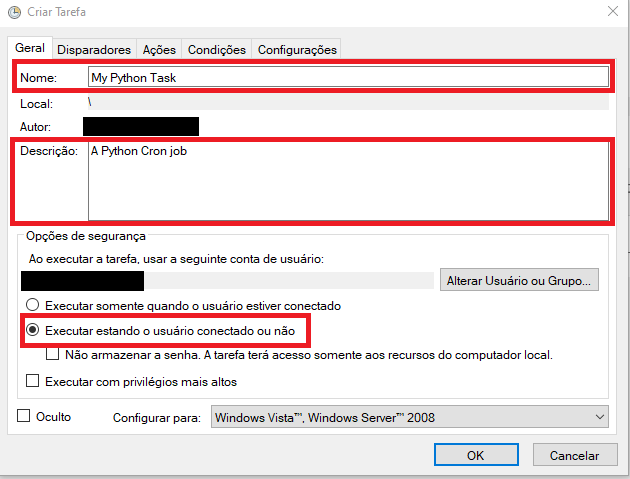
   

5 - Agora na aba Disparadores criaremos um trigger "gatilho" para nossa tarefa

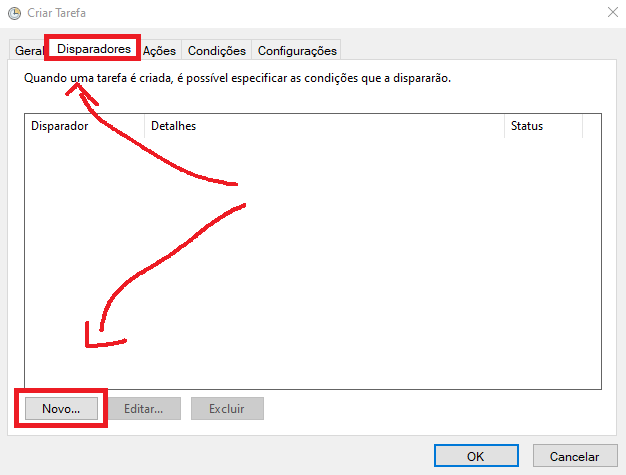
   

6 - 1- Cadastraremos como agendamento, 2 - qual a reconrrencia da tarefa, 3- Quando sera executado, 4 - algumas configurações adicionais como atraso, interrupção, etc, 5 - Habilite o trigger

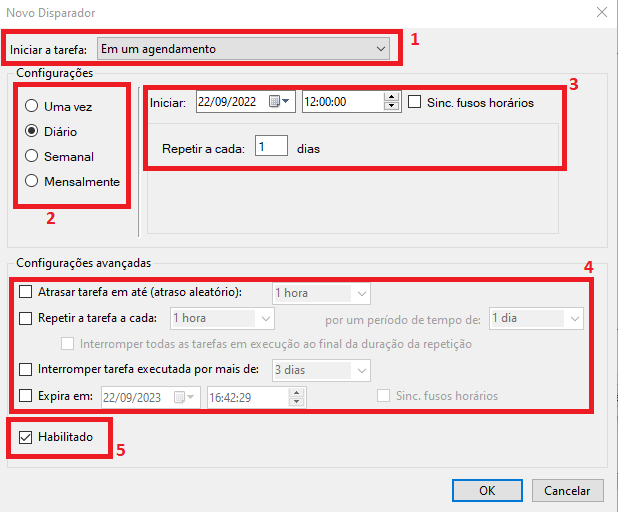
   

7 - Agora na aba Ação criaremos uma nova ação para nosso trigger

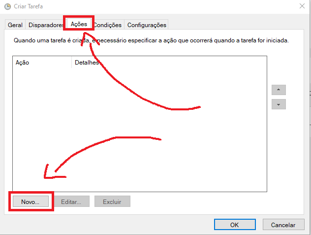
   

8 - Antes de prosseguir precisamos saber algumas inforações, como o caminho que esta nosso python, para isso abra o prompt de comando ou cmd e digite <code>where python</code> e copie o caminho que aparecera

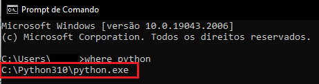
   

9 - Também precisamos do comando de execução do nosso programa por exemplo <code>python main.py</code> é o comando para usarmos a main, como o caminho do python ja sera informado, precisamos apenas informar o comando sem o prefixo do python, verifique no final desse arquivo a as linhas de comando utilizados

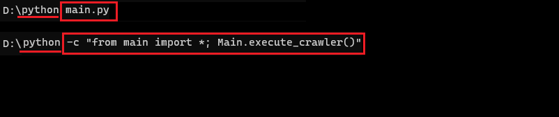
   

10 - E por ultimo o local que está o nosso arquivo main.py, basta usar o navegador de arquivos para achar

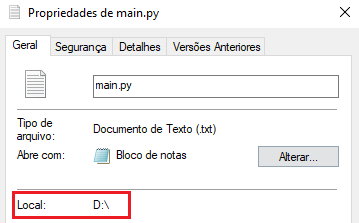
   

11 - Com as informações coletadas vamos inserir em 1 - O caminho do python, 2 - O comando de execução do programa, 3 - O local de nosso arquivo main.py

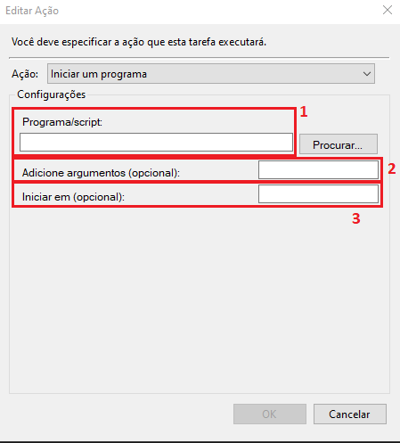
 

<h2>Informações sobre comandos</h2>

Para executar um comando em python precisamos do prefixo python ou py, por exemplo <code>python main.py</code> ou  <code>py main.py</code>, ele indicara ao sistema que a execução do comando deve ser feita com ele

Para executar uma função/metodo dentro de uma classe no python usamos o comando <code>python -c "from 'arquivo' import *; 'NomeClasse'.'nome_metodo'()</code> exemplo: <code>python -c "from main import*; Main.execute_crawler()"</code>

<h2>O que precisamos configurar</h2>

Agora que voce ja sabe como configurar um Cron Job, precisamos configurar 2 cron jobs

O primeiro é semanal que deve executar dois comandos <code>-c "from main import *; Main.execute_crawler()"</code> que executara o nosso crawler 1 vez por semana e depois o comando: <code>-c "from main import*; Main.send_message(1)"</code> que executara o email sender para os usuarios cadastrados como semanalmente

O segundo sera um mensal que executara o comando: <code>-c "from main import *; Main.send_message(2)</code> que executara o email sender para usuarios cadastrados como mensalmente

<h2>Referencias</h2>

<ul>
<li><a href="https://www.youtube.com/watch?v=4n2fC97MNac">How to Run a Python Script with the Windows Task Scheduler</a></li>
</ul>
